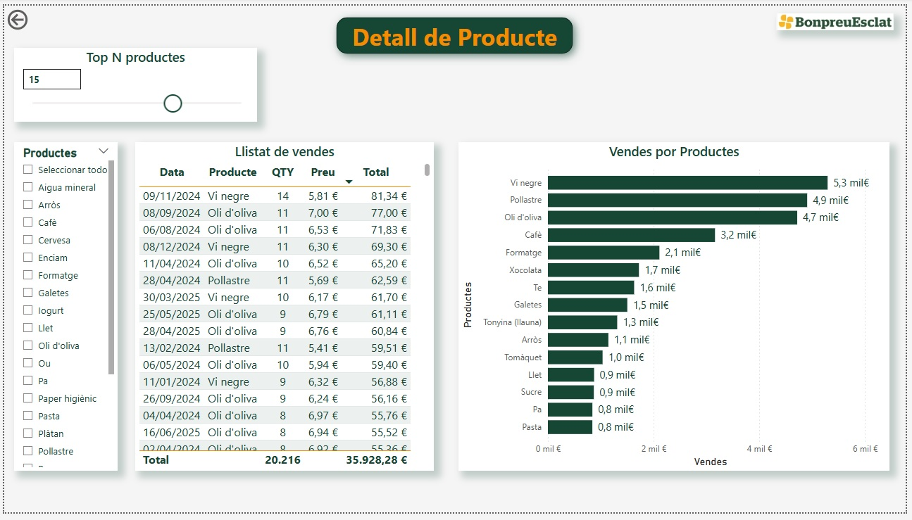
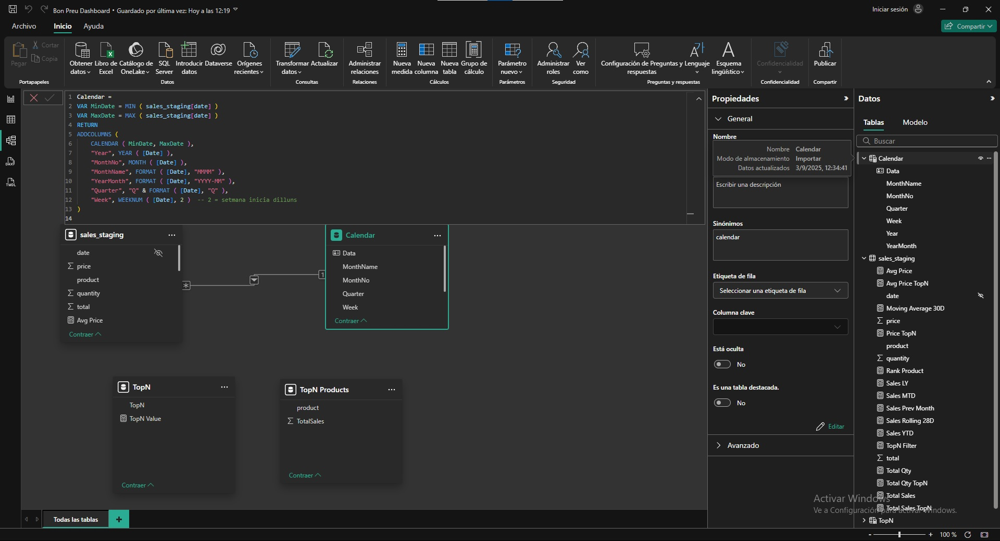

# 📊 Sales Analytics Pipeline

A complete, production-ready **sales analytics web application**: a pandas ETL
pipeline loads retail sales data into MySQL, and an interactive Streamlit
dashboard visualizes revenue, orders, products and trends.

**Architecture:**

```
CSV Dataset → Python ETL (Pandas) → MySQL Database → Streamlit Dashboard → Cloud Deployment
```

Built as a portfolio project — clean, modular code that a 3rd-year CSE student
can read, run and extend.

---

## ✨ Features

- **End-to-end ETL pipeline** — extract CSV, clean/validate/deduplicate,
  compute revenue (`total = quantity × price`), enrich with product categories,
  load into MySQL (idempotent, re-runnable, `--truncate` for full refresh)
- **Interactive dashboard** — KPI cards, revenue-by-product bar chart,
  category donut, daily revenue trend, top-sellers table, filterable data
  table with CSV download
- **Filters** — date range, multi-select categories, multi-select products
  (all applied as parameterized SQL, never string interpolation)
- **Robust states** — loading spinners, friendly connection errors with
  step-by-step fix instructions, empty-data handling
- **Tested** — 35 pytest tests: ETL logic, SQL correctness (against SQLite),
  connection error handling, and an end-to-end pipeline run
- **CI/CD** — GitHub Actions runs tests + a dashboard boot smoke test and
  builds the Docker image on every push
- **Deployment-ready** — Dockerfile + docker-compose (MySQL + ETL + app),
  cloud deployment guide below

## 🧰 Technologies

| Layer | Tools |
|---|---|
| Data processing | Python 3.10+, pandas |
| Database | MySQL 8.0, SQLAlchemy, PyMySQL |
| Dashboard | Streamlit, Plotly |
| Config | python-dotenv (environment variables) |
| Testing | pytest |
| Ops | Docker, Docker Compose, GitHub Actions |

## 📂 Project Structure

```
Sales-data-pipeline/
├── app.py                     # Streamlit dashboard (frontend + page logic)
├── etl/
│   ├── etl_main.py            # ETL pipeline: extract → transform → load
│   └── product_catalog.py     # product → category mapping (single source of truth)
├── database/
│   └── connection.py          # SQLAlchemy engine + friendly error handling
├── queries/
│   └── sales_queries.py       # parameterized SQL for every dashboard element
├── utils/
│   ├── config.py              # env loading + MySQL URI builder
│   └── format.py              # money/number formatting helpers
├── sql/
│   └── schema.sql             # documented MySQL schema (optional manual init)
├── tests/                     # pytest suite (ETL, queries, connection, e2e)
├── data/
│   └── input.csv              # sales dataset (4,000 rows)
├── powerBI/                   # original Power BI dashboard + theme + screenshots
├── .streamlit/config.toml     # Streamlit theme
├── .env.example               # template for database credentials
├── docker-compose.yml         # MySQL + ETL + dashboard, one command
├── Dockerfile                 # app image (Streamlit by default)
├── generate_data.py           # regenerates the synthetic dataset
└── .github/workflows/ci.yml   # CI: tests + smoke test + image build
```

## 🚀 Local Setup

### 1. Clone and create a virtual environment

```bash
git clone https://github.com/nakulsharma97/Sales-data-pipeline.git
cd Sales-data-pipeline

python -m venv venv
# Windows:
venv\Scripts\activate
# macOS/Linux:
source venv/bin/activate

pip install -r requirements.txt
```

### 2. Configure MySQL credentials

```bash
cp .env.example .env      # Windows CMD: copy .env.example .env
```

Edit `.env` with your real MySQL credentials:

```env
MYSQL_USER=retail_user
MYSQL_PASSWORD=your_password
MYSQL_HOST=localhost
MYSQL_PORT=3306
MYSQL_DATABASE=retail_demo
```

### 3. Create the database and user

Using MySQL root:

```sql
CREATE DATABASE IF NOT EXISTS retail_demo;
CREATE USER IF NOT EXISTS 'retail_user'@'%' IDENTIFIED BY 'your_password';
GRANT SELECT, INSERT, CREATE, INDEX ON retail_demo.* TO 'retail_user'@'%';
FLUSH PRIVILEGES;
```

Or run the provided script: `mysql -u root -p < sql/schema.sql`

> The ETL also creates the table automatically on first run.

### 4. Run the ETL pipeline

```bash
python etl/etl_main.py                # load data/input.csv (append)
python etl/etl_main.py --truncate    # full refresh: empty table first
python etl/etl_main.py --csv path/to/other.csv   # custom input file
```

Expected output:

```
[1/3] Extract: reading data/input.csv
      4000 raw rows
[2/3] Transform: cleaning and enriching
      4000 clean rows
[3/3] Load: writing to MySQL
      4000 rows loaded into 'sales_staging'
✅ ETL finished successfully
```

### 5. Run the dashboard

```bash
streamlit run app.py
```

Open http://localhost:8501 🎉

### 6. Run the tests

```bash
pytest tests/ -v
```

(Tests run without a MySQL server — SQL correctness is verified against SQLite.)

## 🐳 Run with Docker (one command)

```bash
cp .env.example .env    # edit credentials first
docker compose up --build
```

This starts:
1. **MySQL** (with healthcheck)
2. **ETL** (runs once, loads the CSV, exits)
3. **Streamlit dashboard** at http://localhost:8501

## ☁️ Cloud Deployment (student-friendly)

The simplest low-cost path: **Streamlit Community Cloud (free) + a free MySQL
cloud database**.

### Step 1 — Free MySQL cloud database

Pick one:
- **Aiven** (free MySQL plan) · **Railway** (MySQL plugin) · **PlanetScale** ·
  **AlwaysData** (free tier)

Create the database, note the **host, port, user, password, database name**,
and run the ETL locally against it once to load the data:

```bash
# .env now points at the cloud DB
MYSQL_HOST=your-host.aivencloud.com
MYSQL_PORT=12345
...
python etl/etl_main.py
```

### Step 2 — Deploy the dashboard to Streamlit Community Cloud

1. Push this repo to GitHub.
2. Go to [share.streamlit.io](https://share.streamlit.io) → **New app** →
   select your repo, branch `main`, main file `app.py`.
3. Under **Advanced settings → Secrets**, paste (TOML format):

```toml
MYSQL_USER = "retail_user"
MYSQL_PASSWORD = "your_password"
MYSQL_HOST = "your-host.aivencloud.com"
MYSQL_PORT = "12345"
MYSQL_DATABASE = "retail_demo"
```

4. Deploy. Your public URL: `https://your-app.streamlit.app` — share it on
   your resume and GitHub profile.

> Streamlit Community Cloud reads secrets as environment variables, which is
> exactly what `utils/config.py` consumes — no code changes needed.

### Alternative: Docker on a small VM

Any cheap VM (EC2 t3.micro / Oracle Cloud free tier / DigitalOcean droplet):

```bash
git clone https://github.com/nakulsharma97/Sales-data-pipeline.git
cd Sales-data-pipeline
cp .env.example .env && nano .env
docker compose up --build -d
# open http://<vm-public-ip>:8501  (allow port 8501 in the firewall)
```

## 🔐 Environment Variables

| Variable | Required | Description |
|---|---|---|
| `MYSQL_USER` | yes* | MySQL username |
| `MYSQL_PASSWORD` | yes* | MySQL password |
| `MYSQL_HOST` | no | default `localhost` |
| `MYSQL_PORT` | no | default `3306` |
| `MYSQL_DATABASE` | yes* | database name |
| `MYSQL_URI` | no | full SQLAlchemy URI, overrides all of the above |

\* Not required when `MYSQL_URI` is set. Never commit `.env` — it's gitignored.

## 🖼 Screenshots

> Dashboard sections: KPI cards · Revenue by Product · Revenue Share by
> Category · Daily Revenue Trend · Top-Selling Products · filterable data
> table with CSV export.





*(Screenshots above are from the original Power BI version; replace with
Streamlit captures after your first run.)*

## 🔮 Future Improvements

- Incremental ETL (only load rows newer than the last sync)
- Automated scheduled refresh (GitHub Actions cron → rerun ETL)
- Row-level authentication on the dashboard
- Slowly-changing dimension table for product prices
- JSON/YAML-driven category mapping instead of a Python dict
- Docker image publishing to GitHub Container Registry

---

👨‍💻 **Author**

Nakul Sharma
📧 [nakulsharma978397@gmail.com](mailto:nakulsharma978397@gmail.com)
🔗 [LinkedIn](https://www.linkedin.com/in/nakulsharma97) | [GitHub](https://github.com/nakulsharma97)
